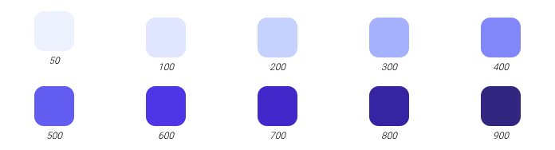

<div align="center">


# [Gust](https://gust-six.vercel.app/)

Component library for React and Tailwind CSS.

</div>

## Documentation

- [Set Up Tailwind](#tailwind)
- [Colors](#colors)
- [Fonts](#fonts)

### Set Up Tailwind

<a name="tailwind" />

To get started, install Tailwind CSS. For more details, visit the [Tailwind docs](https://tailwindcss.com/docs/installation).

```shell
npm install -D tailwindcss
```

```shell
npx tailwindcss init
```

This will create a config file in the root of your directory.

```javascript
// ./tailwing.config.js
module.exports = {
  content: ['./src/**/*.{html,js}'],
  theme: {
    extend: {},
    screens: {
      sm: '640px',
      md: '768px',
      lg: '1024px',
      xl: '1280px',
    },
  },
  plugins: [],
};
```

Then import the required Tailwind files in your css.

```css
/* ./src/index.css */

@tailwind base;
@tailwind components;
@tailwind utilities;
```

### Colors

<a name="colors" />

By default, Gust uses Tailwind's indigo as the primary color.

These colors render like so.

<div align="center">
  
</div>

Add these colors to your Tailwind config. It should now look like this:

```javascript
// ./tailwing.config.js

module.exports = {
  content: ['./src/**/*.{html,js}'],
  theme: {
    extend: {
      colors: {
        primary: {
          50: '#eef2ff',
          100: '#e0e7ff',
          200: '#c7d2fe',
          300: '#a5b4fc',
          400: '#818cf8',
          500: '#6366f1',
          600: '#4f46e5',
          700: '#4338ca',
          800: '#3730a3',
          900: '#312e81',
        },
      },
    },
    screens: {
      sm: '640px',
      md: '768px',
      lg: '1024px',
      xl: '1280px',
    },
  },
  plugins: [],
};
```

To use another color for you project, replace the colors defined in your config file.

Alternatively, choose a color from [Tailwind's selection](https://tailwindcss.com/docs/customizing-colors).

You can then replace all occurences of primary with the color of your choice.

## Fonts

<a name="fonts" />

Gust uses two fonts: a sans serif and a handwriting typeface.

Download the Roboto family from Google Fonts [here](https://fonts.google.com/specimen/Nanum+Pen+Script).

Download the Nanum Pen Script family from Google Fonts [here](https://fonts.google.com/specimen/Roboto).

Add both inside a fonts directory in your project.

```
> src
  > fonts
    > Roboto
      - font-sans-bb.ttf
      - font-sans-b.ttf
      ...
      - Roboto.css
    > NanumPenScript
      - NanumPenScript-regular.ttf
```

Inside your Roboto.css file, import the fonts using Font Face.

```css
/* ./src/fonts/Roboto/Roboto.css */

@font-face {
  font-family: 'font-sans-bb';
  src: local('font-sans-bb'), url('./font-sans-bb.ttf') format('truetype');
}

... @font-face {
  font-family: 'Roboto-Light';
  src: local('Roboto-Light'), url('./Roboto-Light.ttf') format('truetype');
}

@font-face {
  font-family: 'NanumPenScript';
  src: local('NanumPenscript-Regular'), url('./NanumPenscript-Regular.ttf') format('truetype');
}
```

Then import this file in your index.css

Add your fonts to your Tailwind config file.

```javascript
// ./tailwind.config.js

module.exports = {
  content: ['./src/**/*.{html,js}'],
  theme: {
    fontFamily: {
      hand: 'NanumPenScript',
      sans: 'font-sans',
      'sans-m': 'font-sans-m',
      'sans-b': 'font-sans-b',
      'sans-bb': 'font-sans-bb',
    },
    extend: {
      colors: {
        primary: {
          50: '#eef2ff',
          100: '#e0e7ff',
          200: '#c7d2fe',
          300: '#a5b4fc',
          400: '#818cf8',
          500: '#6366f1',
          600: '#4f46e5',
          700: '#4338ca',
          800: '#3730a3',
          900: '#312e81',
        },
      },
    },
    screens: {
      sm: '640px',
      md: '768px',
      lg: '1024px',
      xl: '1280px',
    },
  },
  plugins: [],
};
```

Remember that Tailwind uses [Preflight](https://tailwindcss.com/docs/preflight).

This removes default margins and leaves headings unstyled.

```html
<h1>Title</h1>
<p>Paragraph</p>
```

In this example, Heading and Paragraph will be the same size.

To change the font size, use Tailwinds classes names like t-shirt sizing.

```html
<h1 className="text-3xl">Title</h1>
<p className="text-md">Paragraph</p>
```

If you would like to use another font, find another from Google or any other source and follow the steps above.

I recommend using a font with at least 5 variants for your sans-serif.
